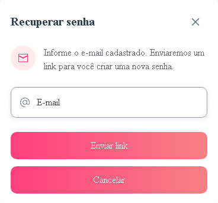
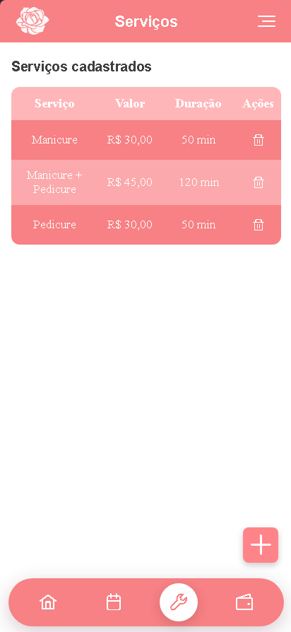
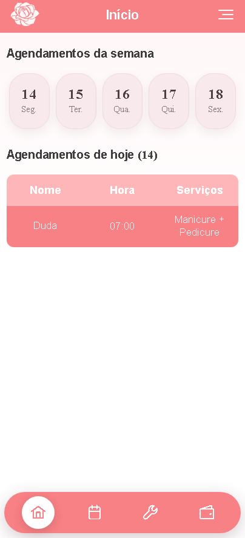
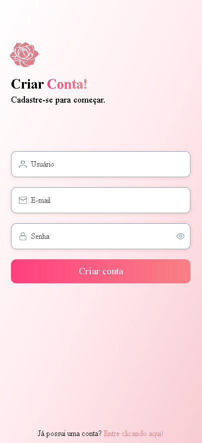
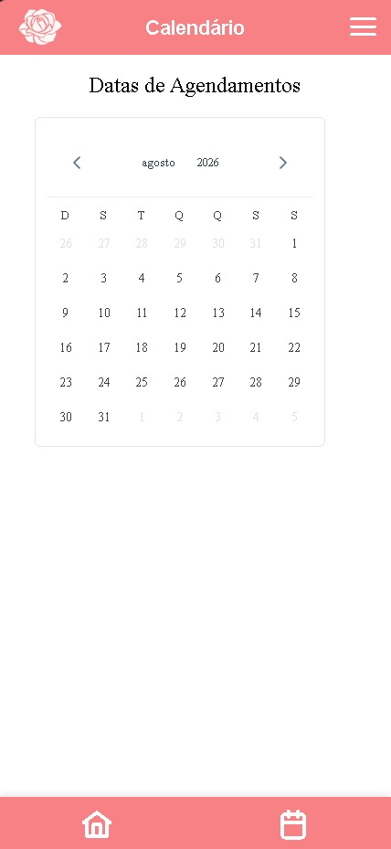
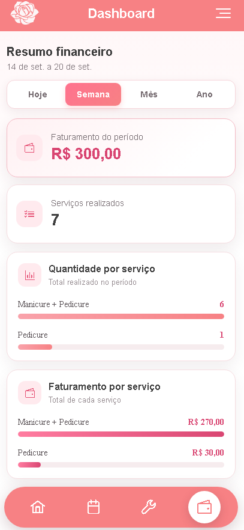
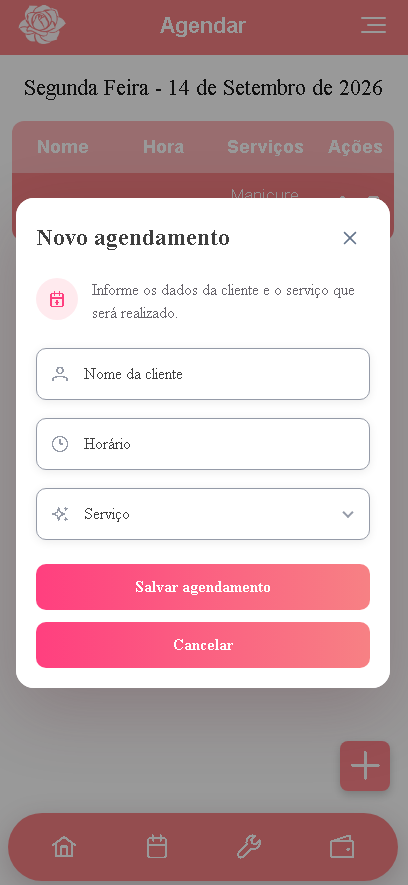
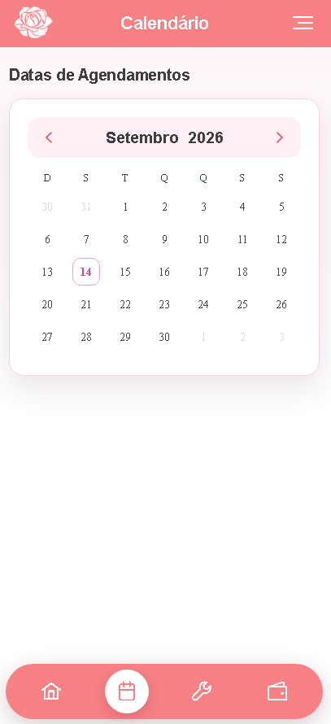

<p align="center">
  
</p>

<h1 align="center">Agenda Rosa</h1>

<p align="center">
  Sistema web para gerenciamento de agendamentos, serviços e informações financeiras de profissionais do setor da beleza.
</p>

<p align="center">
  
  
  
  
</p>

<p align="center">
  <a href="https://agenda-rosa-60b87.web.app/login"><strong>Acessar aplicação</strong></a>
</p>

## Sobre o projeto

A Agenda Rosa foi desenvolvida para centralizar atividades importantes da rotina da **Poliane Design**, microempresa que oferece serviços de depilação e micropigmentação. A aplicação reúne o gerenciamento de agendamentos, o cadastro de serviços e o acompanhamento dos ganhos em um único ambiente.

O sistema surgiu como um projeto de extensão do curso de **Análise e Desenvolvimento de Sistemas**. Seu desenvolvimento partiu da observação de uma necessidade real, da comunicação com a proprietária e da validação das funcionalidades na rotina da empresa. Embora tenha sido criado para esse contexto, o projeto pode futuramente ser adaptado para outros profissionais do setor da beleza.

## Funcionalidades

- Autenticação de usuários com Firebase Authentication;
- Criação de conta e recuperação de senha por e-mail;
- Visualização dos agendamentos do dia e da semana;
- Consulta de datas por meio de calendário;
- Cadastro, edição e exclusão de agendamentos;
- Cadastro e exclusão lógica de serviços;
- Seleção de serviços previamente cadastrados durante o agendamento;
- Dashboard com acompanhamento dos ganhos previstos;
- Consulta financeira por dia, semana, mês e ano;
- Exibição da quantidade e do faturamento por serviço;
- Confirmações antes de ações importantes;
- Interface responsiva desenvolvida com abordagem mobile-first.

## Evolução visual

### Tela de acesso

| Antes | Atual |
| :---: | :---: |
|  |  |

### Página inicial

| Antes | Atual |
| :---: | :---: |
|  |  |

### Calendário

| Antes | Atual |
| :---: | :---: |
|  |  |

## Principais telas

### Autenticação e acesso

| Criação de conta | Recuperação de senha |
| :---: | :---: |
|  |  |

### Agendamentos e serviços

| Novo agendamento | Gerenciamento de serviços |
| :---: | :---: |
|  |  |

### Dashboard

<p align="center">
  
</p>

O dashboard apresenta o faturamento previsto, a quantidade de serviços realizados e a participação de cada serviço no período selecionado.

## Tecnologias utilizadas

| Categoria | Tecnologias |
| --- | --- |
| Front-end | Angular 21, TypeScript 5.9, HTML e CSS |
| Interface | PrimeNG, PrimeIcons e PrimeUIX Themes |
| Autenticação | Firebase Authentication |
| Banco de dados | Cloud Firestore |
| Armazenamento local | LocalStorage |
| Hospedagem | Firebase Hosting |
| Versionamento | Git e GitHub |

## Organização do projeto

```text
src/
├── app/
│   ├── features/
│   │   ├── auth/
│   │   ├── home/
│   │   └── main/
│   └── shared/
│       ├── components/
│       └── services/
├── environments/
└── styles.css
```

- `features/auth`: páginas e componentes de autenticação;
- `features/home`: página inicial e resumo dos agendamentos;
- `features/main`: calendário, agendamentos, serviços e dashboard;
- `shared/components`: componentes reutilizáveis da interface;
- `shared/services`: serviços compartilhados pela aplicação;
- `environments`: configurações específicas de ambiente.

## Como executar localmente

### Pré-requisitos

- Node.js;
- npm;
- Angular CLI, opcionalmente instalado de forma global.

### Instalação

```bash
git clone https://github.com/felipe-pereira-fullstack/agenda-rosa.git
cd agenda-rosa
npm install
npm start
```

A aplicação ficará disponível em:

```text
http://localhost:4200
```

### Build de produção

```bash
npm run build
```

Os arquivos compilados serão gerados no diretório `dist/`.

### Testes

```bash
npm test
```

## Configuração do Firebase

Para utilizar outro projeto Firebase, substitua as configurações presentes em `src/app/app.config.ts` e revise os arquivos em `src/environments/`.

Também é necessário configurar no Firebase Console:

1. O método de autenticação por e-mail e senha;
2. O banco de dados Cloud Firestore;
3. As regras de acesso adequadas para as coleções da aplicação;
4. O Firebase Hosting, caso seja realizada uma nova publicação.

## Melhorias futuras

- Permitir a seleção de períodos personalizados no dashboard;
- Adicionar a edição de serviços preservando o histórico de preços;
- Diferenciar pagamentos recebidos de valores pendentes;
- Exportar relatórios financeiros em PDF;
- Enviar lembretes de agendamentos por e-mail ou WhatsApp;
- Validar a solução com outros profissionais do setor da beleza;
- Avaliar a evolução do projeto para uma plataforma SaaS.

## Autor

Desenvolvido por **Felipe Pereira**.

- [LinkedIn](https://www.linkedin.com/in/felipe-pereira-fullstack)
- [GitHub](https://github.com/felipe-pereira-fullstack)

## Direitos autorais

Este projeto não possui uma licença de código aberto. Todos os direitos estão reservados ao autor.
